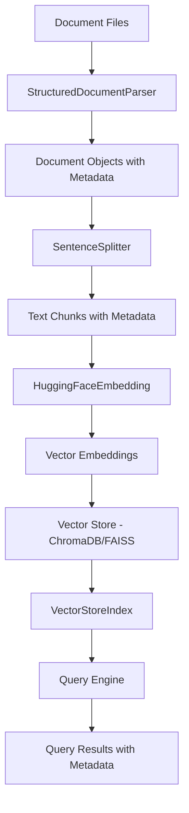

# Design Document: Metadata Extraction and Ingestion

## Overview

This design modifies the RAG system's ingestion pipeline to extract and preserve structured metadata from documents. Currently, the system uses `SimpleDirectoryReader` which ignores metadata headers, resulting in "Source: N/A" and "Category: N/A" in query results. The solution replaces `SimpleDirectoryReader` with the existing `StructuredDocumentParser` to extract metadata (title, category, source URL, institution, publication date) and persist it through the vector store to the query results.

The design maintains backward compatibility with unstructured documents and preserves the enhanced text format that improves retrieval quality by including metadata context in embeddings.

### Key Design Decisions

1. **Leverage Existing Parser**: Use the already-implemented `StructuredDocumentParser` rather than extending `SimpleDirectoryReader`, as it already handles the structured format correctly.

2. **Minimal Changes to Ingestion**: Replace only the document loading mechanism in `src/ingest.py`, keeping the rest of the pipeline (chunking, embedding, storage) unchanged.

3. **Metadata Passthrough**: LlamaIndex's `Document` objects naturally carry metadata through the pipeline to the vector store, requiring no custom serialization logic.

4. **Graceful Degradation**: Handle documents without metadata by using fallback values (filename for title, "Uncategorized" for category) in the query display layer.

## Architecture

### Component Interaction Flow



### Data Flow

1. **Ingestion Phase**:
   - `StructuredDocumentParser.parse_directory()` reads `.txt` files from `data/documents/`
   - Parser extracts metadata fields and creates enhanced text format
   - Returns `Document` objects with `text` (enhanced) and `metadata` dict
   - `SentenceSplitter` chunks documents, preserving metadata in each chunk
   - `HuggingFaceEmbedding` generates embeddings from enhanced text
   - Vector store persists embeddings with associated metadata

2. **Query Phase**:
   - User submits query to `QueryEngineManager`
   - Retriever finds similar chunks from vector store
   - Each retrieved node includes original metadata
   - Response formatter displays metadata fields (title, category) or fallbacks

### Modified Components

- **src/ingest.py**: Replace `SimpleDirectoryReader` with `StructuredDocumentParser`
- **src/query_engine.py**: Update result formatting to display metadata with fallbacks
- **src/document_parser.py**: No changes needed (already implements required functionality)

## Components and Interfaces

### StructuredDocumentParser (Existing)

Located in `src/document_parser.py`, this component already implements the required functionality:

```python
class StructuredDocumentParser:
    @staticmethod
    def parse_file(file_path: Path) -> Optional[Document]:
        """Parse a structured document file and extract metadata"""
        # Returns Document with:
        # - text: enhanced format with metadata preamble
        # - metadata: dict with title, category, source_url, institution, 
        #             publication_date, summary, file_name, file_path
        
    @staticmethod
    def parse_directory(directory: Path) -> List[Document]:
        """Parse all .txt documents in a directory"""
        # Returns list of Document objects
```

**Interface Contract**:
- Input: File path or directory path
- Output: `Document` objects with populated `text` and `metadata` fields
- Error Handling: Returns `None` for unparseable files, logs errors, continues processing

### Modified Ingestion Pipeline

The `build_index()` function in `src/ingest.py` will be modified:

**Current Implementation**:
```python
docs = SimpleDirectoryReader(input_dir=DATA_DIR, recursive=True).load_data()
```

**New Implementation**:
```python
from pathlib import Path
from src.document_parser import StructuredDocumentParser

docs = StructuredDocumentParser.parse_directory(Path(DATA_DIR))
```

**Downstream Compatibility**:
- `SentenceSplitter` accepts `List[Document]` - no change needed
- `VectorStoreIndex.from_documents()` accepts `List[Document]` - no change needed
- Metadata automatically flows through LlamaIndex's node creation and storage

### Query Result Formatting

The `QueryEngineManager.query()` method in `src/query_engine.py` currently includes source metadata in results. Enhancement needed:

**Current Source Info Structure**:
```python
source_info = {
    "content": node.text[:200] + "...",
    "metadata": node.metadata,
    "score": getattr(node, 'score', None)
}
```

**Enhanced Display Logic** (to be added in presentation layer or query method):
```python
def format_source_display(metadata: dict) -> dict:
    """Format metadata for display with fallbacks"""
    return {
        "title": metadata.get("title", metadata.get("file_name", "Unknown")),
        "category": metadata.get("category", "Uncategorized"),
        "source_url": metadata.get("source_url"),
        "institution": metadata.get("institution"),
        "publication_date": metadata.get("publication_date")
    }
```

## Data Models

### Document Metadata Schema

The metadata dictionary attached to each `Document` object:

```python
{
    "title": str,              # Document title from TITLE header
    "category": str,           # Category from CATEGORY header
    "source_url": str,         # URL from SOURCE URL header
    "institution": str,        # Institution from INSTITUTION header
    "publication_date": str,   # Date from PUBLICATION DATE header
    "summary": str,            # Extracted summary section
    "file_name": str,          # Original filename
    "file_path": str           # Full file path
}
```

**Field Requirements**:
- All fields are optional (may be empty string or absent)
- `file_name` and `file_path` are always populated by parser
- Other fields populated only if present in document headers

### Enhanced Text Format

The `Document.text` field contains metadata context for better retrieval:

```
Title: {title}
Category: {category}
Institution: {institution}

Summary: {summary}

Content:
{main_content}
```

This format:
- Places metadata at the beginning for embedding context
- Maintains original content structure
- Improves semantic search by including categorical information

### Vector Store Metadata Persistence

**ChromaDB**:
- Metadata stored as document-level attributes in the collection
- Automatically persisted with embeddings
- Retrieved with query results via LlamaIndex integration

**FAISS**:
- Metadata stored in LlamaIndex's `StorageContext` docstore
- Persisted to disk alongside FAISS index files
- Retrieved by document ID during query processing

## Correctness Properties


A property is a characteristic or behavior that should hold true across all valid executions of a system—essentially, a formal statement about what the system should do. Properties serve as the bridge between human-readable specifications and machine-verifiable correctness guarantees.

### Property Reflection

After analyzing the acceptance criteria, several properties were identified as redundant:

- Requirements 1.2-1.6 are specific cases of 1.1 (all test individual metadata field extraction, which 1.1 covers comprehensively)
- Requirement 2.3 duplicates 1.1 (both test metadata population)
- Requirements 3.2-3.4 are implementation-specific versions of 3.1 (metadata persistence round-trip)
- Requirements 4.1 and 4.2 can be combined (both test metadata display in results)
- Requirement 5.3 duplicates 5.2 (both test continued processing after individual failures)
- Requirements 6.2 and 6.3 can be combined into 6.1 (all test enhanced text format structure)

The following properties represent the unique, non-redundant validation requirements:

### Property 1: Metadata Extraction Completeness

For any document with structured headers containing title, category, source_url, institution, and publication_date fields, parsing that document should produce a Document object with all five metadata fields populated with the correct values from the headers.

**Validates: Requirements 1.1, 1.2, 1.3, 1.4, 1.5, 1.6, 2.3**

### Property 2: Recursive Directory Processing

For any directory structure containing .txt files at various depths, processing that directory should result in all .txt files being parsed regardless of their nesting level.

**Validates: Requirements 2.4**

### Property 3: Metadata Persistence Round-Trip

For any document with metadata, ingesting that document into the vector store and then retrieving it should return the same metadata fields with the same values (metadata should survive the round-trip through the vector store).

**Validates: Requirements 3.1, 3.2, 3.3, 3.4**

### Property 4: Metadata Display in Query Results

For any document with title and category metadata, when that document appears in query results, the result should display the actual title and category values rather than "N/A" or placeholder text.

**Validates: Requirements 4.1, 4.2**

### Property 5: Unstructured Document Processing

For any document without structured metadata headers, parsing that document should produce a Document object with the full text content preserved and empty metadata fields (the parser should not fail or reject unstructured documents).

**Validates: Requirements 5.1, 5.4**

### Property 6: Partial Failure Isolation

For any collection of documents where some documents fail to parse, the ingestion pipeline should successfully process all parseable documents (individual failures should not prevent other documents from being ingested).

**Validates: Requirements 5.2, 5.3**

### Property 7: Enhanced Text Format Structure

For any document with metadata, the Document.text field should contain an enhanced format where metadata fields (title, category, institution, summary) appear at the beginning, followed by the original content, and the Document.metadata dict should contain the same metadata fields separately accessible.

**Validates: Requirements 6.1, 6.2, 6.3, 6.4**

### Edge Cases

The following edge cases should be handled by the property test generators:

- **Empty metadata values**: Documents with headers present but empty values (e.g., "TITLE: ")
- **Missing metadata headers**: Documents with some but not all metadata fields
- **Malformed headers**: Headers with unusual spacing or formatting
- **Special characters**: Metadata values containing unicode, newlines, or special characters
- **Large documents**: Documents exceeding typical size to test chunking with metadata preservation
- **Empty files**: Zero-byte or whitespace-only files

## Error Handling

### Parser Error Handling

The `StructuredDocumentParser.parse_file()` method already implements error handling:

```python
try:
    # Parse document
    return Document(text=enhanced_text, metadata=metadata)
except Exception as e:
    print(f"Error parsing {file_path}: {e}")
    return None
```

**Error Scenarios**:
1. **File Read Errors**: Permission denied, file not found, encoding issues
   - Action: Log error, return `None`, continue with next file
   
2. **Malformed Metadata**: Invalid header format, unparseable dates
   - Action: Extract what's possible, use empty strings for failed fields
   
3. **Empty Files**: Zero-byte or whitespace-only files
   - Action: Create Document with empty metadata and empty/whitespace text

### Ingestion Pipeline Error Handling

The `parse_directory()` method handles individual file failures:

```python
for file_path in directory.glob('*.txt'):
    doc = StructuredDocumentParser.parse_file(file_path)
    if doc:
        documents.append(doc)
```

**Behavior**:
- Failed parses return `None` and are skipped
- Successful parses are accumulated
- Pipeline continues regardless of individual failures

### Vector Store Error Handling

Vector store operations may fail due to:
- Disk space exhaustion
- Permission issues
- Corrupted index files

**Mitigation**:
- Pre-flight checks: Verify directory permissions and disk space before ingestion
- Atomic operations: Use vector store's built-in transaction support where available
- Error propagation: Allow vector store exceptions to bubble up for operator intervention

### Query-Time Error Handling

Missing metadata in query results:

```python
def format_source_display(metadata: dict) -> dict:
    return {
        "title": metadata.get("title", metadata.get("file_name", "Unknown")),
        "category": metadata.get("category", "Uncategorized"),
        # ... other fields with None as acceptable value
    }
```

**Fallback Strategy**:
- Title: Use `file_name` if title missing, "Unknown" if both missing
- Category: Use "Uncategorized" if missing
- Other fields: Display as empty/None (acceptable for optional fields)

## Testing Strategy

### Dual Testing Approach

This feature requires both unit tests and property-based tests for comprehensive coverage:

**Unit Tests** focus on:
- Specific example documents with known metadata values
- Edge cases like empty files, malformed headers, missing fields
- Integration between ingestion and query components
- Error conditions and logging behavior

**Property-Based Tests** focus on:
- Universal properties that hold across all valid inputs
- Comprehensive input coverage through randomization
- Metadata preservation through the entire pipeline
- Behavior across different vector store backends

### Property-Based Testing Configuration

**Framework**: Use `hypothesis` for Python property-based testing

**Configuration**:
- Minimum 100 iterations per property test (due to randomization)
- Each test must reference its design document property in a comment
- Tag format: `# Feature: metadata-extraction-ingestion, Property {number}: {property_text}`

**Example Property Test Structure**:

```python
from hypothesis import given, strategies as st
import hypothesis

@given(
    title=st.text(min_size=1, max_size=200),
    category=st.text(min_size=1, max_size=100),
    source_url=st.text(min_size=1, max_size=500),
    institution=st.text(min_size=1, max_size=200),
    publication_date=st.text(min_size=1, max_size=50)
)
@hypothesis.settings(max_examples=100)
def test_metadata_extraction_completeness(title, category, source_url, institution, publication_date):
    """
    Feature: metadata-extraction-ingestion, Property 1: 
    For any document with structured headers, all metadata fields should be extracted
    """
    # Create document with structured headers
    doc_content = f"""TITLE: {title}
CATEGORY: {category}
SOURCE URL: {source_url}
INSTITUTION: {institution}
PUBLICATION DATE: {publication_date}
---
SUMMARY
Test summary
---
FULL CLEANED TEXT CONTENT
Test content
"""
    
    # Parse document
    with tempfile.NamedTemporaryFile(mode='w', suffix='.txt', delete=False) as f:
        f.write(doc_content)
        temp_path = Path(f.name)
    
    try:
        doc = StructuredDocumentParser.parse_file(temp_path)
        
        # Verify all metadata fields extracted
        assert doc.metadata['title'] == title
        assert doc.metadata['category'] == category
        assert doc.metadata['source_url'] == source_url
        assert doc.metadata['institution'] == institution
        assert doc.metadata['publication_date'] == publication_date
    finally:
        temp_path.unlink()
```

### Test Coverage Requirements

**Unit Test Coverage**:
- Parser: Test each metadata field extraction individually
- Parser: Test documents without metadata headers
- Parser: Test malformed documents and error cases
- Ingestion: Test integration with vector stores (ChromaDB and FAISS)
- Query: Test metadata display with and without fallbacks

**Property Test Coverage**:
- One property test per correctness property (7 total)
- Each test runs minimum 100 iterations
- Tests cover both ChromaDB and FAISS vector stores
- Tests include edge case generators for empty values, special characters, etc.

### Integration Testing

**End-to-End Test Flow**:
1. Create test documents with known metadata
2. Run ingestion pipeline
3. Query the index
4. Verify metadata appears correctly in results
5. Test with both vector store backends

**Backward Compatibility Test**:
1. Ingest mix of structured and unstructured documents
2. Verify all documents are processed
3. Verify structured documents show metadata
4. Verify unstructured documents show fallback values

## Implementation Notes

### Migration Path

For existing deployments:

1. **No Data Migration Required**: Existing vector stores can remain in place
2. **Incremental Adoption**: New ingestions will include metadata; old data will use fallbacks
3. **Re-ingestion Option**: Operators can optionally re-ingest documents to add metadata to existing entries

### Performance Considerations

**Parsing Overhead**:
- Regex-based metadata extraction is fast (microseconds per document)
- Enhanced text format adds minimal overhead (string concatenation)
- Overall ingestion time dominated by embedding generation, not parsing

**Storage Overhead**:
- Metadata adds ~500 bytes per document (negligible compared to embeddings)
- ChromaDB and FAISS handle metadata efficiently
- No significant impact on query performance

### Configuration Changes

No new configuration settings required. The feature uses existing settings:
- `DOCUMENTS_DIR`: Source directory for documents
- `VECTOR_STORE_TYPE`: Determines ChromaDB vs FAISS
- `CHROMA_PERSIST_DIR` / `INDEX_DIR`: Storage locations

### Logging and Observability

Enhanced logging for ingestion:

```python
logger.info(f"Parsing {len(files)} documents from {directory}")
logger.debug(f"Extracted metadata from {file_path}: {metadata}")
logger.warning(f"Failed to parse {file_path}: {error}")
logger.info(f"Successfully ingested {len(documents)} documents")
```

Metrics to track:
- Number of documents parsed successfully
- Number of documents with complete metadata
- Number of parsing failures
- Ingestion time per document

## Dependencies

### Existing Dependencies

All required dependencies are already in the project:

- `llama-index-core`: Document and VectorStoreIndex classes
- `llama-index-vector-stores-chroma`: ChromaDB integration
- `llama-index-vector-stores-faiss`: FAISS integration
- `llama-index-embeddings-huggingface`: Embedding generation

### Testing Dependencies

For property-based testing:

```
hypothesis>=6.0.0  # Property-based testing framework
```

This should be added to `requirements.txt` or a separate `requirements-dev.txt`.

## Security Considerations

### Input Validation

The parser handles untrusted document content:

- **Path Traversal**: Uses `Path.glob()` which doesn't follow symlinks by default
- **File Size**: No explicit limit; relies on system memory constraints
- **Encoding**: Uses UTF-8 with error handling for invalid characters
- **Injection**: Metadata stored as strings, not executed; safe from code injection

### Metadata Sanitization

Metadata values are stored as-is without sanitization:

- **Rationale**: Metadata is displayed to users who uploaded the documents
- **Risk**: Low; metadata not used in SQL queries or shell commands
- **Recommendation**: If metadata is later used in web UI, apply HTML escaping at display time

### Access Control

File system access:

- **Read Access**: Parser requires read access to `DOCUMENTS_DIR`
- **Write Access**: Vector store requires write access to `CHROMA_PERSIST_DIR` or `INDEX_DIR`
- **Recommendation**: Run ingestion with minimal required permissions

## Future Enhancements

Potential improvements beyond this feature:

1. **Metadata Validation**: Add schema validation for metadata fields (e.g., date format validation)
2. **Custom Metadata Fields**: Support user-defined metadata fields beyond the standard set
3. **Metadata Search**: Enable filtering queries by metadata (e.g., "only search documents from institution X")
4. **Metadata Extraction from PDFs**: Extend parser to extract metadata from PDF document properties
5. **Automatic Categorization**: Use LLM to auto-generate categories for documents without CATEGORY header
